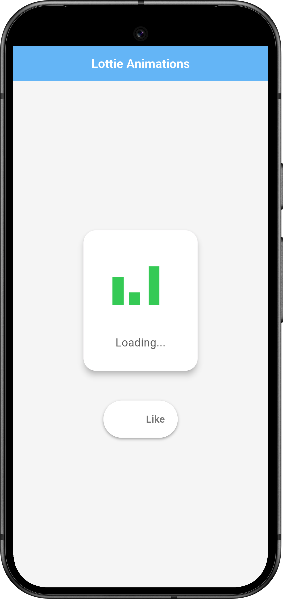
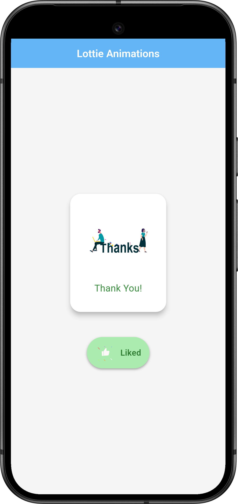
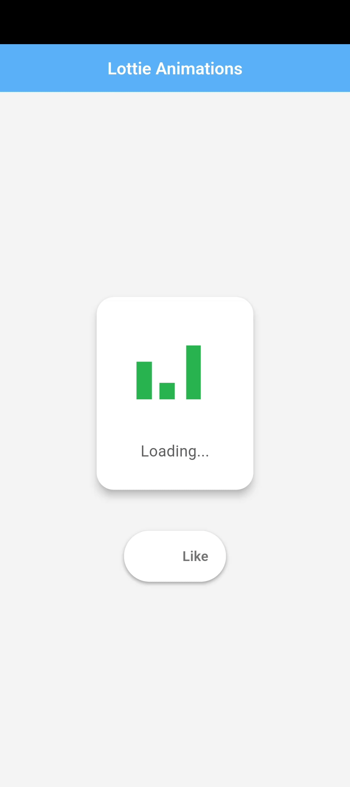

# Flutter Lottie Animations Demo

This Flutter project demonstrates the integration and usage of Lottie animations to enhance user interface and user experience. It showcases two main use cases: a loading animation and an interactive like button with a dynamic animation change.

## Features

*   **Loading Animation:** A looping Lottie animation displayed while content is loading.
*   **Interactive Like Button:** A button with a Lottie animation that plays once when clicked, providing visual feedback to the user.
*   **Dynamic Animation Change:** The central loading animation changes to a "Thank You" animation upon liking, providing engaging feedback.
*   **Clean and Modern UI:** The UI is designed with a clean, modern aesthetic using Material Design components and consistent styling.
*   **Robust Animation Handling:** Includes proper handling of animation loading and controller management to prevent errors.

## Screenshots


Example:

<table>
  <tr>
    <td align="center">
      
      <br>Loading State
    </td>
    <td align="center">
      
      <br>Liked State
    </td>
      <td align="center">
      
      <br>Like Animation
    </td>
  </tr>
</table>
## Getting Started

To run this project:

1.  **Clone the repository:**

    ```bash
    git clone https://github.com/sayed3li97/flutter_lottie_demo.git
    ```

2.  **Navigate to the project directory:**

    ```bash
    cd flutter_lottie_demo
    ```

3.  **Install dependencies:**

    ```bash
    flutter pub get
    ```

4.  **Add Lottie Animations:**
    *   Download Lottie JSON files for loading, like, and thanks animations (e.g., from [LottieFiles](https://lottiefiles.com/)).
    *   Create an `assets/animations` directory in your project.
    *   Place the JSON files in the `assets/animations` directory.
    *   Update your `pubspec.yaml` file:

    ```yaml
    flutter:
      assets:
        - assets/animations/
        - assets/animations/loading.json
        - assets/animations/like.json
        - assets/animations/thanks.json
    ```

5.  **Run the app:**

    ```bash
    flutter run
    ```

## Code Highlights

*   **Conditional Animation Rendering:** The central animation is dynamically switched between loading and thanks animations based on the like state.

    ```dart
    isLiked
        ? Lottie.asset('assets/animations/thanks.json')
        : Lottie.asset('assets/animations/loading.json'),
    ```

*   **One-Time Like Animation:** The like animation plays only once per click using `_likeController.forward().whenComplete(() => _likeController.reset());`.

*   **Proper Animation Controller Management:** The `onLoaded` callback is used to ensure the animation duration is set correctly, preventing errors.

    ```dart
    Lottie.asset(
        // ...
        onLoaded: (composition) {
          setState(() {
            _lottieLoaded = true;
            _likeController.duration = composition.duration;
          });
        },
    );
    ```

## Dependencies

*   `lottie: ^3.3.0` (or latest)

## Contributing

Contributions are welcome! Please open an issue or submit a pull request.

## Author

[Sayed Ali Alkamel/GitHub Profile](https://github.com/sayed3li97/)

## License

MIT License

Copyright (c) [2025] [Sayed Ali Alkamel]

Permission is hereby granted, free of charge, to any person obtaining a copy
of this software and associated documentation files (the "Software"), to deal
in the Software without restriction, including without limitation the rights
to use, copy, modify, merge, publish, distribute, sublicense, and/or sell
copies of the Software, and to permit persons to whom the Software is
furnished to do so, subject to the following conditions:

The above copyright notice and this permission notice shall be included in all
copies or substantial portions of the Software.

THE SOFTWARE IS PROVIDED "AS IS", WITHOUT WARRANTY OF ANY KIND, EXPRESS OR
IMPLIED, INCLUDING BUT NOT LIMITED TO THE WARRANTIES OF MERCHANTABILITY,
FITNESS FOR A PARTICULAR PURPOSE AND NONINFRINGEMENT. IN NO EVENT SHALL THE
AUTHORS OR COPYRIGHT HOLDERS BE LIABLE FOR ANY CLAIM, DAMAGES OR OTHER
LIABILITY, WHETHER IN AN ACTION OF CONTRACT, TORT OR OTHERWISE, ARISING FROM,
OUT OF OR IN CONNECTION WITH THE SOFTWARE OR THE USE OR OTHER DEALINGS IN THE
SOFTWARE.